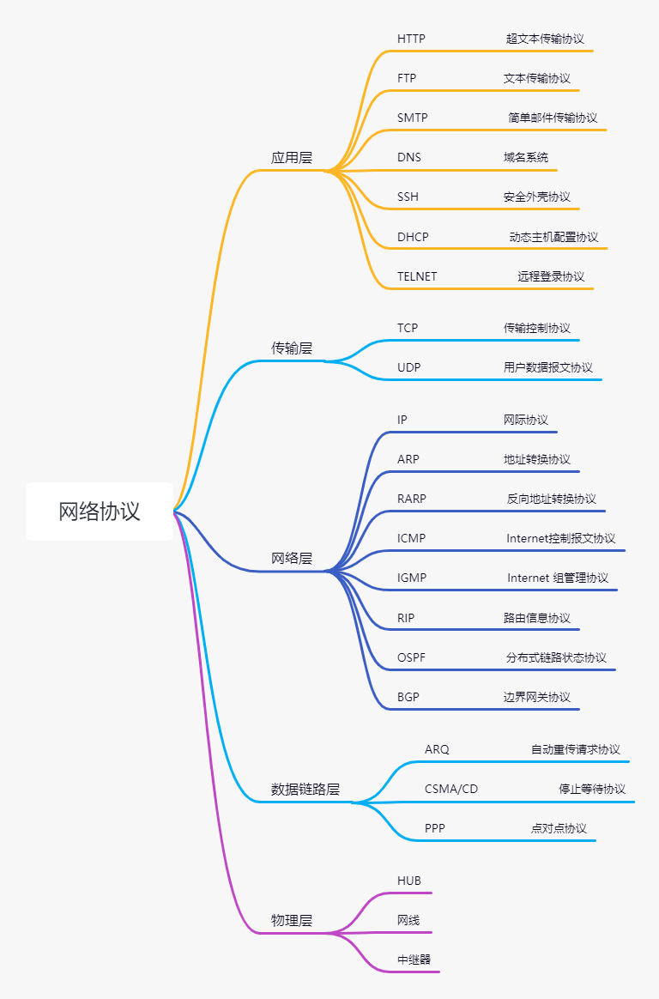
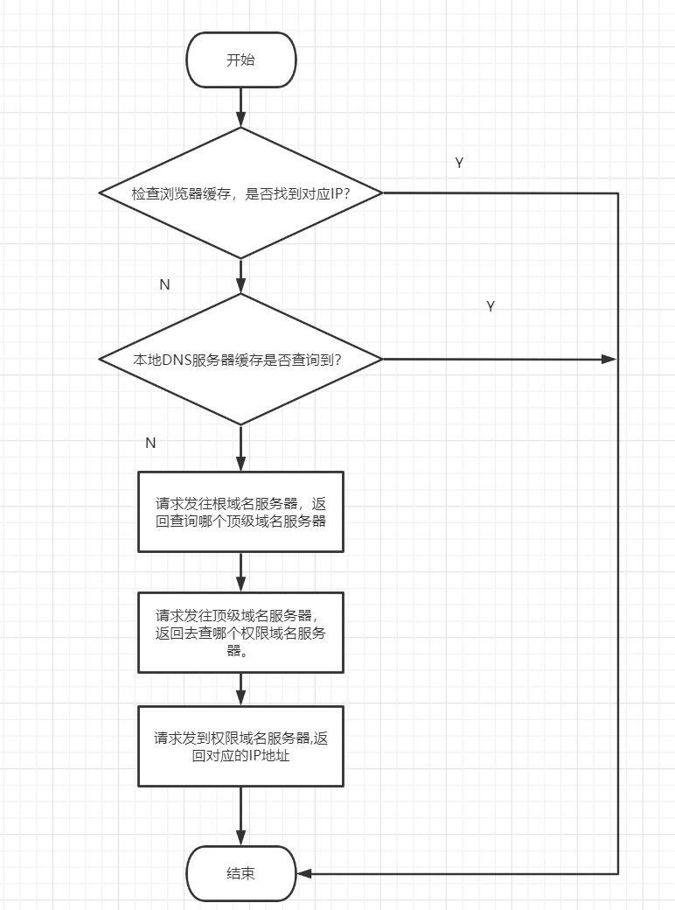
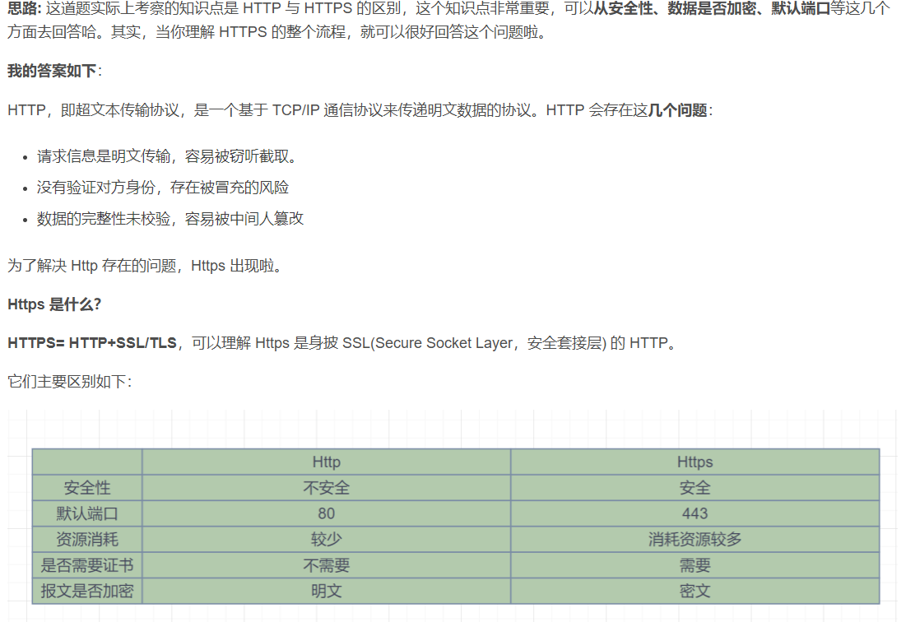

## 

# 实习经历

## 手提包有没有做超时处理

## zabbix对什么进行的监控

# 网络

## 各层都有什么

## 说说 DNS 的解析过程？

## 请简述 TCP 和 UDP 的区别

## http与https

# lvs

## lvs是什么？

## lvs有几种模式

# nginx

## nginx的应用

## nginx的日志切割

# linux

## pid为1的进程，为0的进程有吗？

kill -9 | -15

# mysql

## 事务的的四种隔离登记和可能发生的问题

