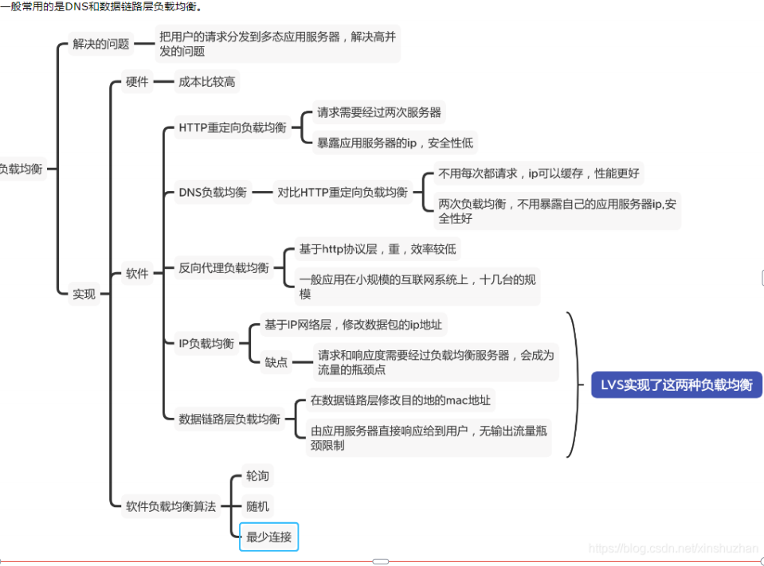

# 简述 LVS 的概念及其作用？
LVS 是 linux virtual server 的简写 linux 虚拟服务器，是一个虚拟的服务器集群系统，可以在
unix/linux 平台下实现负载均衡集群功能。
LVS 的主要作用是：通过 LVS 提供的负载均衡技术实现一个高性能、高可用的服务器群集。因此 LVS 主
要可以实现：
把单台计算机无法承受的大规模的并发访问或数据流量分担到多台节点设备上分别处理，减少用户
等待响应的时间，提升用户体验。
单个重负载的运算分担到多台节点设备上做并行处理，每个节点设备处理结束后，将结果汇总，返
回给用户，系统处理能力得到大幅度提高。
7*24 小时的服务保证，任意一个或多个设备节点设备宕机，不能影响到业务。在负载均衡集群
中，所有计算机节点都应该提供相同的服务，集群负载均衡获取所有对该服务的如站请求。

# 负载均衡有哪些实现方式

# Lvs 工作原理是什么，有哪些工作模式

1.LVS调度器收到目标地址为VIP的请求包后，将MAC地址改成RS（真正的服务器）的MAC地址。并通过交换机（链路层）发给RS。

2.RS的链路层收到请求包后，往上传给IP层。IP层需要验证请求的目标IP地址，所以RS需要配置一个VIP的 loopbak device（策略文件）。这样RS的IP层收到报文后，会往上递交给传输层，之所以配置成loopbak device，是因为loopbak device 对外不可见，不会跟LVS的VIP冲突。

3.RS处理完成后，将应答包直接返回给客户端。

工作模式：LVS-DR，LVS-NAT，LVS-FULLNAT，LVS-TUN

# 谈谈你对LVS的理解？

lvs是一个虚拟的集群系统，采用ip负载均衡技术

lvs有三层分别是

负载均衡器

服务池

共享存储

# 负载均衡的原理是什么？

客户端将请求分发给负载均衡器，负载均衡器再根据调度算法将请求分发给服务池中的真实服务器，以实现压力均摊

# LVS由哪两部分组成的？

1. ipvs,工作在内核
2. ipvsadm，接受用户的命令，为ipvs编辑规则

# 与lvs相关的术语有哪些？

DS 负载调度器

RS 真实服务器

VIP 对外暴露的IP

DIP 内部主机通信的IP

RIP 真实服务器的IP

CIP 客户的IP

# 讲述一下LVS三种模式的工作过程？

1、NAT模式（LVS-NAT）
原理：就是把客户端发来的数据包的IP头的目的地址，在负载均衡器上换成其中一台RS的IP地址，并发至此RS来处理,RS处理完后把数据交给负载均衡器,负载均衡器再把数据包原IP地址改为自己的IP，将目的地址改为客户端IP地址即可期间,无论是进来的流量,还是出去的流量,都必须经过负载均衡器

优点：集群中的物理服务器可以使用任何支持TCP/IP操作系统，只有负载均衡器需要一个合法的IP地址

缺点：扩展性有限。当服务器节点（普通PC服务器）增长过多时,负载均衡器将成为整个系统的瓶颈，因为所有的请求包和应答包的流向都经过负载均衡器。当服务器节点过多时，大量的数据包都交汇在负载均衡器那，速度就会变慢！

2、IP隧道模式（LVS-TUN）
原理：首先要知道，互联网上的大多Internet服务的请求包很短小，而应答包通常很大，那么隧道模式就是，把客户端发来的数据包，封装一个新的IP头标记(仅目的IP)发给RS，RS收到后,先把数据包的头解开,还原数据包,处理后,直接返回给客户端,不需要再经过负载均衡器。注意,由于RS需要对负载均衡器发过来的数据包进行还原,所以说必须支持IPTUNNEL协议，所以,在RS的内核中,必须编译支持IPTUNNEL这个选项

优点：负载均衡器只负责将请求包分发给后端节点服务器，而RS将应答包直接发给用户，所以，减少了负载均衡器的大量数据流动，负载均衡器不再是系统的瓶颈，就能处理很巨大的请求量，这种方式，一台负载均衡器能够为很多RS进行分发。而且跑在公网上就能进行不同地域的分发。

缺点：隧道模式的RS节点需要合法IP，这种方式需要所有的服务器支持”IP Tunneling”(IP Encapsulation)协议，服务器可能只局限在部分Linux系统上

3、直接路由模式（LVS-DR）
原理：负载均衡器和RS都使用同一个IP对外服务但只有DR对ARP请求进行响应，所有RS对本身这个IP的ARP请求保持静默也就是说,网关会把对这个服务IP的请求全部定向给DR，而DR收到数据包后根据调度算法,找出对应的RS,把目的MAC地址改为RS的MAC（因为IP一致），并将请求分发给这台RS这时RS收到这个数据包,处理完成之后，由于IP一致，可以直接将数据返给客户，则等于直接从客户端收到这个数据包无异,处理后直接返回给客户端，由于负载均衡器要对二层包头进行改换,所以负载均衡器和RS之间必须在一个广播域，也可以简单的理解为在同一台交换机上

优点：和TUN（隧道模式）一样，负载均衡器也只是分发请求，应答包通过单独的路由方法返回给客户端，与VS-TUN相比，VS-DR这种实现方式不需要隧道结构，因此可以使用大多数操作系统做为物理服务器。

缺点：（不能说缺点，只能说是不足）要求负载均衡器的网卡必须与物理网卡在一个物理段上。

# LVS的负载调度算法

轮叫调度

加权轮叫调度

最小连接调度

加权最小连接调度

基于局部性能的最少连接

带复制的基于局部性能最小连接

目标地址散列调度

源地址散列调度

# LVS与nginx的区别

lvs的优势（互联网老辛）：

\1. 抗负载能力强，因为lvs工作方式的逻辑是非常简单的，而且工作在网络的第4层，仅作请求分

发用，没有流量，所以在效率上基本不需要太过考虑。lvs一般很少出现故障，即使出现故障

一般也是其他地方（如内存、CPU等）出现问题导致lvs出现问题。

2.配置性低，这通常是一大劣势同时也是一大优势，因为没有太多的可配置的选项，所以除了增减

服务器，并不需要经常去触碰它，大大减少了人为出错的几率。

3.工作稳定，因为其本身抗负载能力很强，所以稳定性高也是顺理成章的事，另外各种lvs都有完整

的双机热备方案，所以一点不用担心均衡器本身会出什么问题，节点出现故障的话，lvs会自动判

别，所以系统整体是非常稳定的。

4.无流量，lvs仅仅分发请求，而流量并不从它本身出去，所以可以利用它这点来做一些线路分流之

用。没有流量同时也保住了均衡器的IO性能不会受到大流量的影响。

5.lvs基本上能支持所有应用，因为lvs工作在第4层，所以它可以对几乎所有应用做负载均衡，包括

http、数据库、聊天室等。

nginx与LVS的对比：

nginx工作在网络的第7层，所以它可以针对http应用本身来做分流策略，比如针对域名、目录结构

等，相比之下lvs并不具备这样的功能，所以nginx单凭这点可以利用的场合就远多于lvs了；但

nginx有用的这些功能使其可调整度要高于lvs，所以经常要去触碰，由lvs的第2条优点来看，触碰

多了，人为出现问题的几率也就会大。

nginx对网络的依赖较小，理论上只要ping得通，网页访问正常，nginx就能连得通，nginx同时还

能区分内外网，如果是同时拥有内外网的节点，就相当于单机拥有了备份线路；lvs就比较依赖于网

络环境，目前来看服务器在同一网段内并且lvs使用direct方式分流，效果较能得到保证。另外注

意，lvs需要向托管商至少申请多于一个ip来做visual ip。

nginx安装和配置比较简单，测试起来也很方便，因为它基本能把错误用日志打印出来。lvs的安装

和配置、测试就要花比较长的时间，因为同上所述，lvs对网络依赖性比较大，很多时候不能配置成

功都是因为网络问题而不是配置问题，出了问题要解决也相应的会麻烦的多。nginx也同样能承受很高负载且稳定，但负载度和稳定度差lvs还有几个等级：nginx处理所有流量

所以受限于机器IO和配置；本身的bug也还是难以避免的；nginx没有现成的双机热备方案，所以

跑在单机上还是风险比较大，单机上的事情全都很难说。

nginx可以检测到服务器内部的故障，比如根据服务器处理网页返回的状态码、超时等等，并且会

把返回错误的请求重新提交到另一个节点。目前lvs中ldirectd也能支持针对服务器内部的情况来监

控，但lvs的原理使其不能重发请求。比如用户正在上传一个文件，而处理该上传的节点刚好在上传

过程中出现故障，nginx会把上传切到另一台服务器重新处理，而lvs就直接断掉了。

**两者配合使用：**

nginx用来做http的反向代理，能够upsteam实现http请求的多种方式的均衡转发。由于采用的是异步转

发可以做到如果一个服务器请求失败，立即切换到其他服务器，直到请求成功或者最后一台服务器失败

为止。这可以最大程度的提高系统的请求成功率。

lvs采用的是同步请求转发的策略。这里说一下同步转发和异步转发的区别。同步转发是在lvs服务器接收

到请求之后，立即redirect到一个后端服务器，由客户端直接和后端服务器建立连接。异步转发是nginx

在保持客户端连接的同时，发起一个相同内容的新请求到后端，等后端返回结果后，由nginx返回给客户

端。

进一步来说：当做为负载均衡服务器的nginx和lvs处理相同的请求时，所有的请求和响应流量都会经过

nginx；但是使用lvs时，仅请求流量经过lvs的网络，响应流量由后端服务器的网络返回。

也就是，当作为后端的服务器规模庞大时，nginx的网络带宽就成了一个巨大的瓶颈。

但是仅仅使用lvs作为负载均衡的话，一旦后端接受到请求的服务器出了问题，那么这次请求就失败了。

但是如果在lvs的后端在添加一层nginx（多个），每个nginx后端再有几台应用服务器，那么结合两者的

优势，既能避免单nginx的流量集中瓶颈，又能避免单lvs时一锤子买卖的问题。
