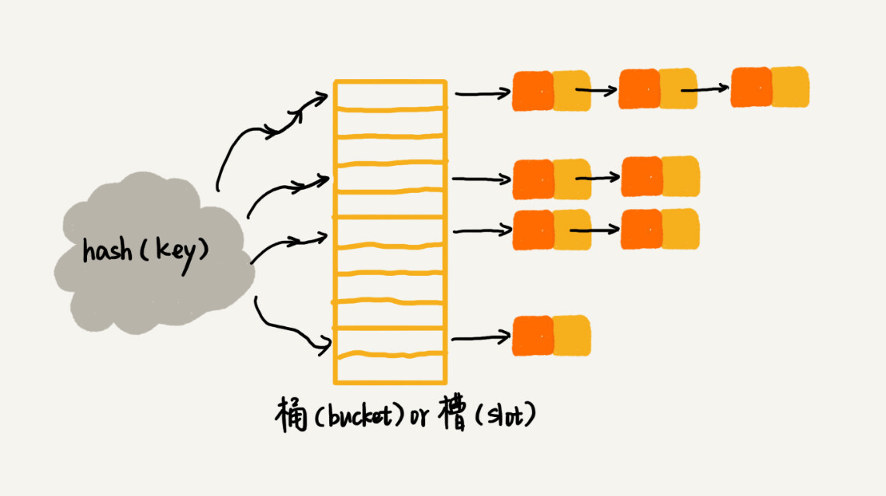

# 树的遍历方式

前 中 后

# 栈和队列区别

栈 先进后出

队列 先进先出

# 栈和队列咋实现

线性表 或 链表

# 散列表是啥

散列表用的是数组支持按照下标随机访问数据的特性，所以散列表其实就是数组的一种扩展，由数组演化而来。可以说，如果没有数组，就没有散列表。

# 怎么解决哈希冲突

1. 开放寻址法（open addressing）对于开放寻址冲突解决方法，除了线性探测方法之外，还有另外两种比较经典的探测方法，二次探测（Quadratic probing）和双重散列（Double hashing）。

2. 链表法（chaining）。

