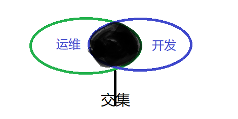

# 什么是运维？

运维是指大型组织已经建立好的网络软硬件的维护，就是要保证业务的上线与运作的正常，
在他运转的过程中，对他进行维护，他集合了网络、系统、数据库、开发、安全、监控于一身的技术
运维又包括很多种，有DBA运维、网站运维、虚拟化运维、监控运维、游戏运维等等

# 什么是运维开发

作者：运维酱尼古拉斯
链接：https://www.zhihu.com/question/36764151/answer/584140328
来源：知乎
著作权归作者所有。商业转载请联系作者获得授权，非商业转载请注明出处。

**从[工作内容](https://www.zhihu.com/search?q=工作内容&search_source=Entity&hybrid_search_source=Entity&hybrid_search_extra={"sourceType"%3A"answer"%2C"sourceId"%3A584140328})上看：** 

**运维：侧重点是“维护”**。对于[运维工程师](https://www.zhihu.com/search?q=运维工程师&search_source=Entity&hybrid_search_source=Entity&hybrid_search_extra={"sourceType"%3A"answer"%2C"sourceId"%3A584140328})来说，其底层的知识储备要很扎实，对于常见问题要有经验总结，这样才会更快速的解决发生的问题；基础的编程知识也需要知道，但不是重点要求，若精通会更好，个人意愿，在此不做具体要求 

**开发**：**侧重点是“编程”**。必须熟练精通编程，且同时还需要学习[前端开发](https://www.zhihu.com/search?q=前端开发&search_source=Entity&hybrid_search_source=Entity&hybrid_search_extra={"sourceType"%3A"answer"%2C"sourceId"%3A584140328})知识，而对于具体的运维工作则是没有什么其他的要求的 

**从[岗位职责](https://www.zhihu.com/search?q=岗位职责&search_source=Entity&hybrid_search_source=Entity&hybrid_search_extra={"sourceType"%3A"answer"%2C"sourceId"%3A584140328})来看**：运维从事的工作也与运维开发有较大差别。运维开发要做的工作是通过开发技能帮助运维实现运维工作的[自动化](https://www.zhihu.com/search?q=自动化&search_source=Entity&hybrid_search_source=Entity&hybrid_search_extra={"sourceType"%3A"answer"%2C"sourceId"%3A584140328})。
    **从运维来说**：因为线上稳定大于天，任何风吹草动都得抓紧起来处理，平常工作的话，以优化服务结构，部署方法和指标采集为重点。 

**对于运维开发来说**：说白了就是“辅助”，或者说是运维的臂膀，需要把运维中遇到的问题提供平台查询，或者把一些常见的重复操作给抽象出来做成工具，减少运维的人工介入。 

**最后** 

总的来说：运维和运维开发是不一样的。运维和运维开发不能比，运维包含运维开发，大家都是运维，基础的系统知识都要有，你不懂系统不懂网络也开发不出来。 

如果要对比的话，相同点的就是运维所必须要会的有基础运维、[网络运维](https://www.zhihu.com/search?q=网络运维&search_source=Entity&hybrid_search_source=Entity&hybrid_search_extra={"sourceType"%3A"answer"%2C"sourceId"%3A584140328})、业务运维、[数据库运维](https://www.zhihu.com/search?q=数据库运维&search_source=Entity&hybrid_search_source=Entity&hybrid_search_extra={"sourceType"%3A"answer"%2C"sourceId"%3A584140328})；不同点就是大家都要懂运维基础知识，但是各自专长不同，比如数据库除了要有基础知识，还要懂数据库怎么优化，开发就不用懂，开发会开发，但也[没必要](https://www.zhihu.com/search?q=没必要&search_source=Entity&hybrid_search_source=Entity&hybrid_search_extra={"sourceType"%3A"answer"%2C"sourceId"%3A584140328})懂。不过作为开发，要满足基础运维、网络运维、业务运维、数据库运维的需求，挑战相对更大，懂得要更多更深入才行。 

用一张图来解释它们之间的关系（画的丑，别见怪）： 

# 什么是SRE

SRE这个词诞生于谷歌公司，其全名叫网站可靠性工程师（Site Reliability Engineer ），它是软件工程师和系统管理员的结合。

在SRE诞生之前，谷歌认为“既然软件工程师职业主要专注于设计和构建软件系统，那么应该有另外一种职业来专注于整个软件系统的生命管理周期”。

# 什么是devops

[(1条消息) 【随笔】DevOps是什么？_Laplace2008的博客-CSDN博客](https://blog.csdn.net/wkkan/article/details/131208804)

# 什么是中间件？什么是jdk？

中间件是一种独立的系统软件或服务程序，分布式应用软件借助这种软件在不同的技术之间共享资源
中间件位于客户机/ 服务器的操作系统之上，管理计算机资源和网络通讯是连接两个独立应用程序或独
立系统的软件。相连接的系统，即使它们具有不同的接口
但通过中间件相互之间仍能交换信息。执行中间件的一个关键途径是信息传递通过中间件，应用程序可
以工作于多平台或OS环境。
jdk：jdk是Java的开发工具包，它是一种用于构建在 Java 平台上发布的应用程序、applet 和组件的开发
环境

# 什么叫网站灰度发布？

灰度发布是指在黑与白之间，能够平滑过渡的一种发布方式
AB test就是一种灰度发布方式，让一部用户继续用A，一部分用户开始用B
如果用户对B没有什么反对意见，那么逐步扩大范围，把所有用户都迁移到B上面 来
灰度发布可以保证整体系统的稳定，在初始灰度的时候就可以发现、调整问题，以保证其影响度

# RabbitMQ是什么东西？

RabbitMQ也就是消息队列中间件，消息中间件是在消息的传息过程中保存消息的容器
消息中间件再将消息从它的源中到它的目标中标时充当中间人的作用
队列的主要目的是提供路由并保证消息的传递；如果发送消息时接收者不可用
消息队列不会保留消息，直到可以成功地传递为止，当然，消息队列保存消息也是有期限地

# 描述一下正向代理和反向代理
正向代理
比如我们国内访问国外网站，直接访问访问不到，我们可以通过一个正向代理服务器，请求发到代理
服，代理服务器能够访问国外网站，这样由代理去国外网站取到返回数据，再返回给我们，这样我们就
能访问了。
反向代理
反向代理实际运行方式是指以代理服务器来接受internet上的连接请求，然后将请求转发给内部网络上
的服务器，并将从服务器上得到的结果返回给internet上请求连接的客户端，此时客户只是访问代理服
务器却不知道后面有多少服务器。

# 简述什么是 CAP 理论？
CAP 理论指出了在分布式系统中需要满足的三个条件，主要包括：
Consistency（一致性）：所有节点在同一时间具有相同的数据；
Availability（可用性）：保证每个请求不管成功或者失败都有响应；
Partition tolerance（分区容错性）：系统中任意信息的丢失或失败不影响系统的继续运行。
CAP 理论的核心是：一个分布式系统不可能同时很好的满足一致性，可用性和分区容错性这三个需求，
最多只能同时较好的满足两个。

# 解释一下什么是分布式部署，负载均衡，反向代理

# 对云原生的理解

云原生（CloudNative）是一个组合词，Cloud+Native。Cloud表示应用程序位于云中，而不是传统的数据中心；Native表示应用程序从设计之初即考虑到云的环境，原生为云而设计，**在云上以最佳姿势运行**，充分利用和发挥云平台的弹性+分布式优势。

我的应对很简单，选一个我最容易记住和理解的定义：DevOps+持续交付+微服务+容器。

**总而言之，符合云原生架构的应用程序应该是：采用开源堆栈（K8S+Docker）进行容器化，基于微服务架构提高灵活性和可维护性，借助敏捷方法、DevOps支持持续迭代和运维自动化，利用云平台设施实现弹性伸缩、动态调度、优化资源利用率。**