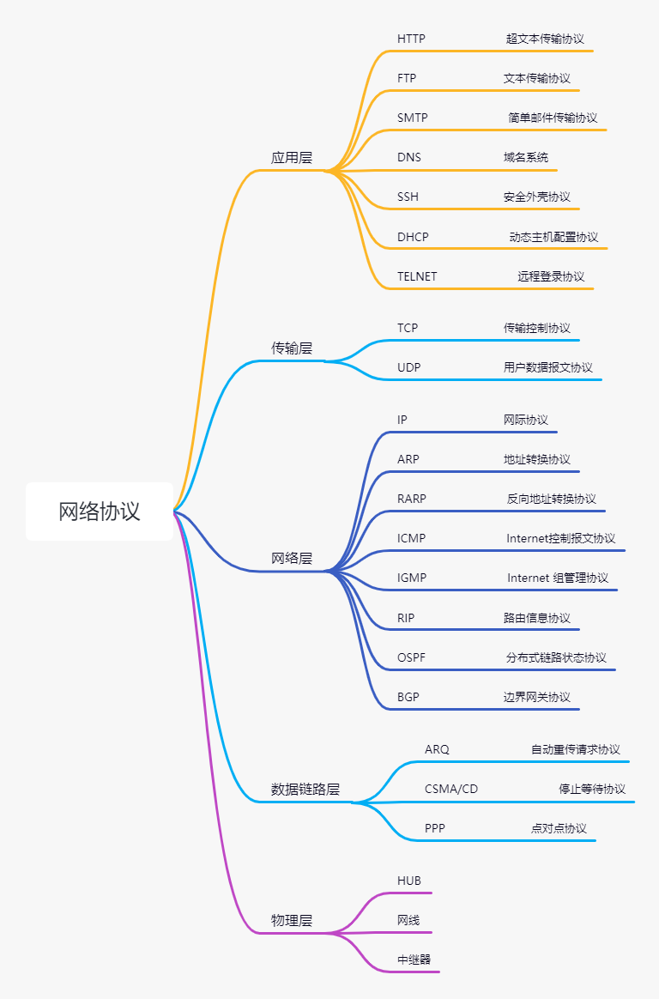

# 安全

# 什么叫 CC 攻击？

CC 攻击，主要是用来攻击页面的，模拟多个用户不停的对你的页面进行访问，从而使你的系统资源消耗

殆尽

怎么预防 CC 攻击和 DDOS 攻击？

防 CC、DDOS 攻击，这些只能是用硬件防火墙做流量清洗，将攻击流量引入黑洞。

流量清洗这一块，主要是买 ISP 服务商的防攻击的服务就可以，机房一般有空余流量，我们一般是买服

务，毕竟攻击不会是持续长时间。

# 常见的加密算法

[常见的几种加密算法 - 简书 (jianshu.com)](https://www.jianshu.com/p/9000a0386e70)

对称性加密算法：AES、DES、3DES

非对称性算法：RSA、DSA、ECC

#  聊聊 SQL 注入？

SQL 注入是一种代码注入技术，一般被应用于攻击 web 应用程序。它通过在 web 应用接口传入一些特殊参数字符，来欺骗应用服务器，执行恶意的 SQL 命令，以达到非法获取系统信息的目的。它目前是黑客对数据库进行攻击的最常用手段之一

# 如何预防 SQL 注入问题
1). 使用 #{} 而不是 ${}

在 MyBatis 中, 使用**#{}**而不是**${}**，可以很大程度防止 sql 注入。

因为**#{}**是一个参数占位符，对于字符串类型，会自动加上 “”，其他类型不加。由于 Mybatis 采用预编译，其后的参数不会再进行 SQL 编译，所以一定程度上防止 SQL 注入。
**${}**是一个简单的字符串替换，字符串是什么，就会解析成什么，存在 SQL 注入风险
2). 不要暴露一些不必要的日志或者安全信息，比如避免直接响应一些 sql 异常信息。

如果 SQL 发生异常了，不要把这些信息暴露响应给用户，可以自定义异常进行响应

3). 不相信任何外部输入参数，过滤参数中含有的一些数据库关键词关键词

可以加个参数校验过滤的方法，过滤union，or等数据库关键词

4). 适当的权限控制

在你查询信息时，先校验下当前用户是否有这个权限。比如说，实现代码的时候，可以让用户多传一个企业 Id 什么的，或者获取当前用户的 session 信息等，在查询前，先校验一下当前用户是否是这个企业下的等等，是的话才有这个查询员工的权限。

# 缓存

# 什么叫CDN？

即内容分发网络，其目的是通过在现有的Internet中增加一层新的网络架构，将网站的内容发布到最接
近用户的网络边缘，使用户可就近取得所需的内容，提高用户访问网站的速度。

# 讲解一下DNS查询的两种模式
递归查询
递归查询是一种DNS 服务器的查询模式，在该模式下DNS 服务器接收到客户机请求，必须使用一个准确
的查询结果回复客户机。如果DNS 服务器本地没有存储查询DNS 信息，那么该服务器会询问其他服务
器，并将返回的查询结果提交给客户机。
迭代查询
DNS 服务器另外一种查询方式为迭代查询，DNS 服务器会向客户机提供其他能够解析查询请求的DNS
服务器地址，当客户机发送查询请求时，DNS 服务器并不直接回复查询结果，而是告诉客户机另一台
DNS 服务器地址，客户机再向这台DNS 服务器提交请求，依次循环直到返回查询的结果为止。

==DNS服务器之间是迭代查询，用户与DNS服务器之间是递归查询。==

# 说下 ARP 协议的工作过程？

ARP 协议协议，Address Resolution Protocol，地址解析协议，它是用于实现 IP 地址到 MAC 地址的映射。

1. 首先，每台主机都会在自己的 ARP 缓冲区中建立一个 ARP 列表，以表示 IP 地址和 MAC 地址的对应关系。
2. 当源主机需要将一个数据包要发送到目的主机时，会首先检查自己的 ARP 列表，是否存在该 IP 地址对应的 MAC 地址；如果有﹐就直接将数据包发送到这个 MAC 地址；如果没有，就向本地网段发起一个 ARP 请求的广播包，查询此目的主机对应的 MAC 地址。此 ARP 请求的数据包里，包括源主机的 IP 地址、硬件地址、以及目的主机的 IP 地址
3. 网络中所有的主机收到这个 ARP 请求后，会检查数据包中的目的 IP 是否和自己的 IP 地址一致。如果不相同，就会忽略此数据包；如果相同，该主机首先将发送端的 MAC 地址和 IP 地址添加到自己的 ARP 列表中，如果 ARP 表中已经存在该 IP 的信息，则将其覆盖，然后给源主机发送一个 ARP 响应数据包，告诉对方自己是它需要查找的 MAC 地址。
4. 源主机收到这个 ARP 响应数据包后，将得到的目的主机的 IP 地址和 MAC 地址添加到自己的 ARP 列表中，并利用此信息开始数据的传输。如果源主机一直没有收到 ARP 响应数据包，表示 ARP 查询失败。

# 聊聊五层计算机网络体系结构中，每一层对应的网络协议有哪些？

# 路由协议

[23 张图详解路由协议：计算机网络的核心技术 - 知乎 (zhihu.com)](https://zhuanlan.zhihu.com/p/384966304)

[路由选择协议 RIP、OSPF、BGP 详解_ospf bgp rip_硕子鸽的博客-CSDN博客](https://blog.csdn.net/weixin_43941364/article/details/105509724)

# Session 和 Cookie 的区别

# 数据链路层

# VLAN实现的功能?怎样实现VLAN间通信?

VLAN（Virtual Local Area Network）即虚拟局域网，是将一个物理的LAN在逻辑上划分成多个广播域的通信技术。
每个VLAN是一个广播域，VLAN内的主机间可以直接通信，而VLAN间则不能直接互通。这样，广播报文就被限制在一个VLAN内。

# 传输层

## * TCP 协议如何保证可靠传输？

（1）应用数据被分割成 TCP 认为最适合发送的数据块。
(2)TCP 给发送的每一个包进行编号，接收方对数据包进行排序，把有序数据传送给应用层
(3)校验和： TCP 将保持它首部和数据的检验和。这是一个端到端的检验和，目的是检测数据在传输过程中的任何变化。如果收到段的检验和有差错，TCP 将丢弃这个报文段和不确认收到此报文段。
(4)TCP 的接收端会丢弃重复的数据。
(5)流量控制： TCP 连接的每一方都有固定大小的缓冲空间，TCP的接收端只允许发送端发送接收端缓冲区能接纳的数据。当接收方来不及处理发送方的数据，能提示发送方降低发送的速率，防止包丢失。TCP 使用的流量控制协议是可变大小的滑动窗口协议。 （TCP 利用滑动窗口实现流量控制）
(6)拥塞控制： 当网络拥塞时，减少数据的发送。
(7)ARQ协议： 也是为了实现可靠传输的，它的基本原理就是每发完一个分组就停止发送，等待对方确认。在收到确认后再发下一个分组;==超时重传==： 当 TCP 发出一个段后，它启动一个定时器，等待目的端确认收到这个报文段。如果不能及时收到一个确认，将重发这个报文段。

## TCP与UDP的区别。
（1）TCP：面向连接，可靠的，速度慢，效率低。

（2）UDP：无连接、不可靠、速度快、效率高。

当进程需要传输可靠的数据时应使用TCP，当进程需要高效传输数据，可以忽略可靠性时应使用UDP协议。

# 网络层

## * Http的报文结构

（1）HTTP请求报文
一个HTTP请求报文由请求行、请求头部、空行和请求数据4个部分组成，下图是请求报文的一般格式。

 

（2）HTTP响应也由三个部分组成，分别是：状态行、消息报头、响应正文。
